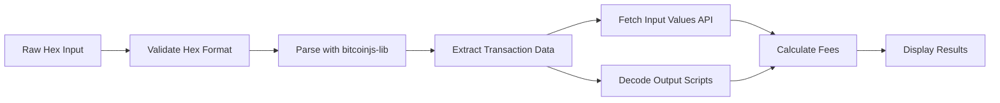

# 🪙 Bitcoin Transaction Parser

> **A Summer of Bitcoin 2026 Project Submission**

An interactive, educational web application that decodes and visualizes Bitcoin transactions in real-time. Built to demonstrate deep understanding of Bitcoin transaction structure, scripting, and fee mechanisms.

[](https://bitcoin-tx-parser.vercel.app)
[](https://www.typescriptlang.org/)
[](https://reactjs.org/)
[](https://bitcoin.org)


---

## 📋 Table of Contents

- [About the Project](#-about-the-project)
- [Key Features](#-key-features)
- [Technical Highlights](#-technical-highlights)
- [Demo & Screenshots](#-demo--screenshots)
- [Quick Start](#-quick-start)
- [How It Works](#-how-it-works)
- [Architecture](#-architecture)
- [Development](#-development)
- [Deployment](#-deployment)
- [Learning Resources](#-learning-resources)
- [Contributing](#-contributing)
- [License](#-license)

---

## 🎯 About the Project

**Bitcoin Transaction Parser** is an educational tool designed to make Bitcoin transaction analysis accessible and intuitive. Whether you're a developer learning Bitcoin protocol internals, a researcher analyzing on-chain data, or an enthusiast exploring how transactions work, this tool provides a comprehensive interface to decode and understand every component of a Bitcoin transaction.

### Why This Project?

Bitcoin transactions are the fundamental units of the Bitcoin protocol, yet their raw hexadecimal format is intimidating for newcomers. This project aims to:

- **Demystify Bitcoin transactions** by providing visual, human-readable representations
- **Educate users** about inputs, outputs, scripts, witness data, and fee calculations
- **Demonstrate practical Bitcoin development** using modern web technologies
- **Showcase real-world blockchain API integration** with live data from Bitcoin mainnet

### Built for Summer of Bitcoin

This project demonstrates proficiency in:
- Bitcoin protocol fundamentals (transaction structure, scripting, SegWit)
- Modern full-stack development (React, TypeScript, REST APIs)
- Real-time blockchain data integration
- User-centric design for technical products

---

## ✨ Key Features

### 1. **Transaction Overview**
- Decode raw hex transactions into human-readable format
- Display transaction ID (TXID), version, locktime
- Show size metrics: raw size, virtual size (vsize), weight units
- Count inputs and outputs

### 2. **Inputs Analysis**
- Parse and display all transaction inputs
- Fetch previous transaction data from Blockstream API
- Show input values in BTC and satoshis
- Display scriptSig and witness data (for SegWit transactions)
- Decode sequence numbers and their meaning

### 3. **Outputs Analysis**
- List all transaction outputs with values
- Decode output addresses (P2PKH, P2SH, P2WPKH, P2WSH, P2TR)
- Identify output types and script patterns
- Display scriptPubKey in hex and decoded format
- Show change outputs vs payment outputs

### 4. **Fee Analysis & Calculator**
- Calculate total transaction fees automatically
- Compute fee rate (sat/vB)
- Compare with real-time mempool recommended fees
- Visual fee status indicator (low/medium/high)
- Fee percentage of total transaction value
- Integration with mempool.space API for current fee market data

### 5. **Script Decoder**
- Decompile Bitcoin scripts into opcodes
- Explain each opcode with human-readable descriptions
- Identify script types (P2PKH, P2SH, P2WPKH, etc.)
- Interactive opcode explorer with detailed documentation
- Support for both scriptSig and scriptPubKey

### 6. **Transaction Visualizer**
- Interactive flow diagram showing inputs → transaction → outputs
- Visual representation of Bitcoin flow
- Color-coded nodes for easy identification
- Zoom and pan controls using ReactFlow
- Perfect for understanding transaction structure at a glance

### 7. **Sample Transaction Loader**
- One-click sample transaction for testing
- Supports both mainnet and testnet transactions
- Helps new users get started immediately

---

## 🔧 Technical Highlights

### Core Technologies

- **Frontend Framework**: React 19.2 with TypeScript 5.7
- **Bitcoin Library**: bitcoinjs-lib 7.0.1 (industry-standard Bitcoin library)
- **Build Tool**: Vite 7.2 (lightning-fast builds)
- **Styling**: TailwindCSS 4.1 (utility-first CSS framework)
- **Visualization**: ReactFlow 11.11 (interactive node graphs)
- **HTTP Client**: Axios 1.13 (API requests)
- **Icons**: Lucide React (beautiful icon system)

### APIs Integrated

1. **Blockstream.info API**: Fetches previous transaction data for input value calculation
2. **Mempool.space API**: Provides real-time fee recommendations

### Bitcoin Protocol Implementation

- Full transaction parsing (version, inputs, outputs, witness, locktime)
- Support for legacy, SegWit (P2WPKH, P2WSH), and Taproot (P2TR) transactions
- Script decompilation and opcode analysis
- Address generation from scriptPubKey
- Weight unit and virtual size calculations
- Fee rate computation

### Code Quality

- **Type Safety**: Full TypeScript with strict mode enabled
- **Modern React**: Functional components with hooks
- **Clean Architecture**: Separation of concerns (components, services, utils, types)
- **Error Handling**: Comprehensive error messages and validation
- **Responsive Design**: Mobile-friendly interface
- **Performance**: Code splitting and lazy loading ready

---

## 📸 Demo & Screenshots

### Live Application

**Try it now**: [bitcoin-tx-parser.vercel.app](https://bitcoin-tx-parser.vercel.app) *(Deploy first to update link)*

### Interface Overview

```
┌─────────────────────────────────────────────────────┐
│  🪙 Bitcoin Transaction Parser                      │
│  Decode and analyze Bitcoin transactions in real-time│
├─────────────────────────────────────────────────────┤
│  Raw Transaction Hex Input                          │
│  ┌─────────────────────────────────────────────┐  │
│  │ 02000000000101a3b2c1d4e5f6071829384a5b6...  │  │
│  └─────────────────────────────────────────────┘  │
│  [Decode Transaction] [Load Sample]                │
├─────────────────────────────────────────────────────┤
│  📊 Transaction Overview                            │
│  TXID: abc123...                                    │
│  Size: 250 bytes | Weight: 1000 | vSize: 250 vB    │
├─────────────────────────────────────────────────────┤
│  📥 Inputs (2)                                       │
│  ┌─────────────────────────────────────────────┐  │
│  │ Input #0: 0.05 BTC from abc123...           │  │
│  │ Input #1: 0.03 BTC from def456...           │  │
│  └─────────────────────────────────────────────┘  │
├─────────────────────────────────────────────────────┤
│  📤 Outputs (2)                                      │
│  ┌─────────────────────────────────────────────┐  │
│  │ Output #0: 0.07 BTC to 1A1zP1...            │  │
│  │ Output #1: 0.0095 BTC to bc1q...            │  │
│  └─────────────────────────────────────────────┘  │
├─────────────────────────────────────────────────────┤
│  💰 Fee Analysis                                    │
│  Fee: 0.0005 BTC (50,000 sat) @ 200 sat/vB        │
│  Status: 🟢 High Priority                          │
└─────────────────────────────────────────────────────┘
```

---

## 🚀 Quick Start

### Prerequisites

- **Node.js**: v20.18.0 or higher (v20.19+, v22+, or v23+ recommended)
- **npm**: v9+ or compatible package manager
- **Git**: For cloning the repository

### Installation

```bash
# Clone the repository
git clone https://github.com/Git-brintsi20/bitcoin-tx-parser.git
cd bitcoin-tx-parser

# Install dependencies
npm install

# Start development server
npm run dev
```

Open [http://localhost:5173](http://localhost:5173) in your browser.

### Quick Test

1. Click **"Load Sample"** to load a test transaction
2. Click **"Decode Transaction"** to parse it
3. Explore all sections: Overview, Inputs, Outputs, Fees, Scripts, Visualizer

### Using Real Transactions

1. Visit [blockstream.info](https://blockstream.info)
2. Find any transaction (e.g., recent block transactions)
3. Copy the "Transaction Hex" (raw transaction data)
4. Paste into the app and click "Decode Transaction"

**Example transactions to try:**
- Genesis coinbase: `01000000010000000000000000000000000000000000000000000000000000000000000000ffffffff4d04ffff001d0104455468652054696d65732030332f4a616e2f32303039204368616e63656c6c6f72206f6e206272696e6b206f66207365636f6e64206261696c6f757420666f722062616e6b73ffffffff0100f2052a01000000434104678afdb0fe5548271967f1a67130b7105cd6a828e03909a67962e0ea1f61deb649f6bc3f4cef38c4f35504e51ec112de5c384df7ba0b8d578a4c702b6bf11d5fac00000000`
- Any recent transaction from Blockstream Explorer

---

## 🧠 How It Works

### Transaction Parsing Flow



### Data Flow Architecture

1. **User Input**: Paste raw transaction hex
2. **Validation**: Check hex format and validity
3. **Parsing**: Use bitcoinjs-lib to decode binary transaction
4. **API Enrichment**: Fetch previous txout values from Blockstream API
5. **Fee Calculation**: Compute fees and compare with mempool recommendations
6. **Script Decoding**: Decompile scripts into human-readable opcodes
7. **Visualization**: Render interactive flow diagram

### Key Algorithms

#### Fee Calculation
```typescript
totalInput = sum(all input values)
totalOutput = sum(all output values)
fee = totalInput - totalOutput
feeRate = fee / virtualSize  // sat/vB
```

#### Address Decoding
```typescript
// Try mainnet first, fallback to testnet
try {
  address = bitcoin.address.fromOutputScript(script, bitcoin.networks.bitcoin)
} catch {
  address = bitcoin.address.fromOutputScript(script, bitcoin.networks.testnet)
}
```

#### Script Type Detection
- Analyze script patterns (P2PKH, P2SH, P2WPKH, P2WSH, P2TR)
- Match against known script templates
- Identify custom/non-standard scripts

---

## 🏗️ Architecture

### Project Structure

```
bitcoin-tx-parser/
├── src/
│   ├── components/          # React components
│   │   ├── TransactionOverview.tsx    # Transaction metadata display
│   │   ├── InputsList.tsx             # Inputs table
│   │   ├── OutputsList.tsx            # Outputs table
│   │   ├── FeeAnalysis.tsx            # Fee calculator
│   │   ├── ScriptDecoder.tsx          # Script opcode decoder
│   │   └── TransactionVisualizer.tsx  # Interactive flow diagram
│   ├── services/            # External API calls
│   │   └── api.ts           # Blockstream & Mempool.space APIs
│   ├── types/               # TypeScript type definitions
│   │   └── transaction.ts   # Transaction data models
│   ├── utils/               # Helper functions
│   │   └── bitcoin.ts       # Bitcoin-specific utilities
│   ├── App.tsx              # Main application component
│   ├── main.tsx             # Application entry point
│   └── index.css            # Global styles
├── public/                  # Static assets
├── vite.config.ts           # Vite build configuration
├── tsconfig.json            # TypeScript configuration
├── tailwind.config.js       # TailwindCSS configuration
├── package.json             # Dependencies and scripts
├── DEPLOYMENT.md            # Deployment guide
├── QUICKSTART.md            # Quick start guide
└── README.md                # This file
```

### Component Hierarchy

```
App
├── TransactionOverview
├── InputsList
├── OutputsList
├── FeeAnalysis
├── ScriptDecoder
└── TransactionVisualizer
```

---

## 💻 Development

### Available Scripts

```bash
# Start development server (hot reload)
npm run dev

# Build for production
npm run build

# Preview production build locally
npm run preview

# Run ESLint for code quality
npm run lint

# Type check without building
npx tsc --noEmit
```

### Development Guidelines

1. **Code Style**: Follow TypeScript best practices and ESLint rules
2. **Components**: Keep components small and focused (Single Responsibility)
3. **Types**: Always use TypeScript types, avoid `any`
4. **Error Handling**: Always wrap API calls in try-catch
5. **Performance**: Use React.memo for expensive components
6. **Accessibility**: Add aria-labels and keyboard navigation

### Adding New Features

1. Create component in `src/components/`
2. Define types in `src/types/`
3. Add utilities in `src/utils/`
4. Import and use in `App.tsx`
5. Test thoroughly with various transaction types

### Testing Checklist

- [ ] Legacy P2PKH transactions
- [ ] P2SH (multisig) transactions
- [ ] SegWit P2WPKH transactions
- [ ] SegWit P2WSH transactions
- [ ] Taproot P2TR transactions
- [ ] Transactions with multiple inputs/outputs
- [ ] Transactions with witness data
- [ ] Test invalid hex input handling
- [ ] Test network errors (API failures)

---

## 🚢 Deployment

### Production Build

```bash
# Build optimized production bundle
npm run build

# Output in dist/ folder
# Bundle size: ~476KB (~152KB gzipped)
```

### Deploy to Vercel (Recommended) ⭐

**One-Click Deploy:**

[](https://vercel.com/new/clone?repository-url=https://github.com/Git-brintsi20/bitcoin-tx-parser)

**Manual Deploy:**

```bash
# Install Vercel CLI
npm install -g vercel

# Login to Vercel
vercel login

# Deploy
vercel --prod
```

**Configuration**: No configuration needed! Vercel auto-detects Vite projects.

### Deploy to Netlify

```bash
# Install Netlify CLI
npm install -g netlify-cli

# Build the project
npm run build

# Deploy
netlify deploy --prod --dir=dist
```

**Or via Netlify Dashboard:**
1. Go to [app.netlify.com](https://app.netlify.com)
2. Click "Add new site" → "Import an existing project"
3. Connect GitHub repository
4. Build command: `npm run build`
5. Publish directory: `dist`
6. Deploy!

### Deploy to GitHub Pages

```bash
# Install gh-pages
npm install -D gh-pages

# Add deploy script to package.json
# "deploy": "npm run build && gh-pages -d dist"

# Deploy
npm run deploy
```

**Note**: Update `vite.config.ts` with base URL:
```typescript
export default defineConfig({
  base: '/bitcoin-tx-parser/',
  plugins: [react()],
})
```

### Environment Variables

**No API keys required!** Both Blockstream and Mempool.space APIs are public and free.

### Post-Deployment Verification

- [ ] Transaction parsing works correctly
- [ ] API calls successful (Blockstream & Mempool.space)
- [ ] Fee recommendations loading
- [ ] Script decoder functioning
- [ ] Visualizer rendering properly
- [ ] Mobile responsive design working
- [ ] All buttons and interactions working

---

## 📚 Learning Resources

### Bitcoin Transaction Fundamentals
- [Bitcoin Developer Guide - Transactions](https://developer.bitcoin.org/devguide/transactions.html)
- [Mastering Bitcoin - Chapter 6: Transactions](https://github.com/bitcoinbook/bitcoinbook/blob/develop/ch06.asciidoc)
- [Bitcoin Optech - Transaction Structure](https://bitcoinops.org/en/topics/transaction/)

### Bitcoin Script
- [Bitcoin Script Wiki](https://en.bitcoin.it/wiki/Script)
- [Script Opcodes Reference](https://en.bitcoin.it/wiki/Script#Opcodes)
- [Learn me a Bitcoin - Scripts](https://learnmeabitcoin.com/technical/script)

### SegWit & Taproot
- [BIP 141: Segregated Witness](https://github.com/bitcoin/bips/blob/master/bip-0141.mediawiki)
- [BIP 341: Taproot](https://github.com/bitcoin/bips/blob/master/bip-0341.mediawiki)
- [Understanding SegWit](https://bitcoincore.org/en/2016/01/26/segwit-benefits/)

### APIs Used
- [Blockstream API Documentation](https://github.com/Blockstream/esplora/blob/master/API.md)
- [Mempool.space API Docs](https://mempool.space/docs/api)

---

## 🤝 Contributing

Contributions are welcome! This project is open-source and aims to be an educational resource for the Bitcoin community.

### How to Contribute

1. Fork the repository
2. Create a feature branch (`git checkout -b feature/amazing-feature`)
3. Commit your changes (`git commit -m 'Add amazing feature'`)
4. Push to the branch (`git push origin feature/amazing-feature`)
5. Open a Pull Request

### Contribution Ideas

- Add support for more script types (P2PK, custom scripts)
- Implement PSBT (Partially Signed Bitcoin Transaction) parsing
- Add transaction history tracking
- Create unit tests with Jest/Vitest
- Improve mobile UI/UX
- Add dark mode theme
- Implement transaction size estimator
- Add RBF (Replace-By-Fee) detection
- Support for transaction simulation

---

## 📄 License

This project is licensed under the **MIT License** - see the [LICENSE](LICENSE) file for details.

---

## 👨‍💻 Author

**Git-brintsi20**  
Summer of Bitcoin 2026 Applicant

- GitHub: [@Git-brintsi20](https://github.com/Git-brintsi20)
- Project: [Bitcoin Transaction Parser](https://github.com/Git-brintsi20/bitcoin-tx-parser)

---

## 🙏 Acknowledgments

- **Summer of Bitcoin** for the opportunity to build and learn
- **bitcoinjs-lib** maintainers for the excellent Bitcoin library
- **Blockstream** for providing free blockchain API
- **Mempool.space** for real-time fee data
- **Bitcoin Core** contributors for the protocol documentation
- The entire **Bitcoin developer community** for endless learning resources

---

## 📊 Project Statistics

- **Lines of Code**: ~2000+ (TypeScript, TSX, CSS)
- **Components**: 6 main React components
- **API Integrations**: 2 (Blockstream, Mempool.space)
- **Bitcoin Features**: Transaction parsing, script decoding, fee calculation, address generation
- **Build Time**: ~3-5 seconds
- **Bundle Size**: 476KB (152KB gzipped)

---

## 🎓 Educational Value

This project demonstrates:

1. **Bitcoin Protocol Mastery**: Deep understanding of transaction structure, scripting, and fees
2. **Modern Web Development**: React, TypeScript, API integration, responsive design
3. **Software Engineering**: Clean code, type safety, modular architecture
4. **User Experience**: Intuitive interfaces for complex technical concepts
5. **Real-World Application**: Integration with live Bitcoin network data

**Perfect for**: Students learning Bitcoin, developers exploring blockchain, educators teaching Bitcoin protocol

---

<div align="center">

**Built with ❤️ for Bitcoin and Open Source**

⭐ **Star this repo** if you found it helpful!  
🐛 **Report issues** to help improve the project  
🔗 **Share** with others learning Bitcoin

[Live Demo](https://bitcoin-tx-parser.vercel.app) • [Report Bug](https://github.com/Git-brintsi20/bitcoin-tx-parser/issues) • [Request Feature](https://github.com/Git-brintsi20/bitcoin-tx-parser/issues)

</div>