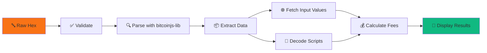
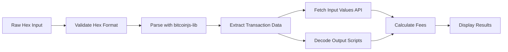

<div align="center">

# 🪙 Bitcoin Transaction Parser

### 🔍 Decode • Analyze • Visualize Bitcoin Transactions

**An Interactive Web Application for Summer of Bitcoin 2026**

[](https://bitcoin-tx-parser.vercel.app)
[](https://github.com/Git-brintsi20/bitcoin-tx-parser)


---

### ✨ Transform Complex Bitcoin Transactions into Beautiful, Understandable Insights


*Transform raw hexadecimal chaos into crystal-clear transaction insights* ⚡

</div>

---

## 🎯 What is This?

**Bitcoin Transaction Parser** is your friendly companion for understanding Bitcoin transactions. Paste any raw transaction hex, and watch it transform into:

- 📊 **Beautiful visualizations** of transaction flow
- 💰 **Smart fee analysis** with live mempool data
- 🔐 **Script decoding** with human-readable opcodes
- 🎨 **Interactive graphs** showing inputs and outputs
- 📈 **Real-time data** from Bitcoin blockchain APIs

Perfect for **students**, **developers**, **researchers**, and **Bitcoin enthusiasts**!

---

## 🚀 Features That Make You Go "Wow!"

<table>
<tr>
<td width="33%" valign="top">

### 🎯 Transaction Decoder
- ✅ Parse raw hex instantly
- ✅ Show TXID, version, locktime
- ✅ Display size & weight metrics
- ✅ Count inputs & outputs
- ✅ Support SegWit & Taproot

</td>
<td width="33%" valign="top">

### 💸 Fee Calculator
- 💰 Calculate exact fees
- 📊 Show sat/vB rate
- 🎯 Compare with mempool
- 🚦 Status: Low/Medium/High
- 📈 Live market data

</td>
<td width="33%" valign="top">

### 🔍 Script Decoder
- 🔐 Decompile opcodes
- 📖 Explain each operation
- 🏷️ Detect script types
- 💡 Educational tooltips
- 🎨 Syntax highlighting

</td>
</tr>
<tr>
<td width="33%" valign="top">

### 📥 Input Analysis
- 🔗 Show previous TXIDs
- 💵 Fetch input values (API)
- 📝 Display scriptSig
- 🎭 Show witness data
- ⏱️ Decode sequences

</td>
<td width="33%" valign="top">

### 📤 Output Analysis
- 📍 Extract addresses
- 🏷️ Identify types (P2PKH, P2WPKH, etc.)
- 💎 Show BTC & satoshis
- 🔑 Display scriptPubKey
- 🎯 Detect change outputs

</td>
<td width="33%" valign="top">

### 🎨 Visual Flow
- 🌊 Interactive graph
- 🎯 Drag & zoom
- 🎨 Color-coded nodes
- ⚡ Live updates
- 📱 Mobile responsive

</td>
</tr>
</table>

---

## 🎬 Quick Start

### ⚡ Try It Now (3 Steps)

```bash
# 1️⃣ Clone the magic
git clone https://github.com/Git-brintsi20/bitcoin-tx-parser.git
cd bitcoin-tx-parser

# 2️⃣ Install dependencies
npm install

# 3️⃣ Launch! 🚀
npm run dev
```

**Open [http://localhost:5173](http://localhost:5173)** and boom! 💥

### 🎮 How to Use

1. **Click "📝 Load Sample"** - Get a real Bitcoin transaction
2. **Or paste your own hex** - Any transaction from blockchain explorers
3. **Hit "Decode Transaction"** - Watch the magic happen! ✨
4. **Explore all features** - Inputs, outputs, fees, scripts, visualizer

---

## 🛠️ Tech Stack (The Cool Stuff)

<div align="center">

### Frontend


### Bitcoin & APIs


### Visualization & Utilities


</div>

---

## 💡 How It Works (The Smart Stuff)



### 🔄 Processing Pipeline

1. **📝 Input**: Paste transaction hex
2. **✅ Validate**: Check hex format
3. **🔍  Parse**: Decode with bitcoinjs-lib 
4. **🌐 Enrich**: Fetch data from Blockstream API
5. **💰 Calculate**: Compute fees & rates
6. **🎨 Visualize**: Render beautiful UI

### 🎯 Key Algorithms

**Fee Calculation:**
```javascript
totalInput = Σ(all input values from API)
totalOutput = Σ(all output values)
fee = totalInput - totalOutput
feeRate = fee / virtualSize  // sat/vB
```

**Address Decoding:**
```javascript
// Try mainnet → fallback to testnet
address = bitcoin.address.fromOutputScript(script, network)
```

---

## 📁 Project Structure

```
bitcoin-tx-parser/
├── 📄 src/
│   ├── 🎨 components/          # React components
│   │   ├── TransactionOverview.tsx
│   │   ├── InputsList.tsx
│   │   ├── OutputsList.tsx
│   │   ├── FeeAnalysis.tsx
│   │   ├── ScriptDecoder.tsx
│   │   └── TransactionVisualizer.tsx
│   ├── 🌐 services/            # API calls
│   │   └── api.ts
│   ├── 📝 types/               # TypeScript types
│   │   └── transaction.ts
│   ├── 🔧 utils/               # Helper functions
│   │   └── bitcoin.ts
│   ├── App.tsx                 # Main app
│   └── main.tsx                # Entry point
├── 📦 public/                  # Static assets
├── ⚙️ vite.config.ts           # Build config
├── 🎨 tailwind.config.js       # Styling config
└── 📖 README.md                # You are here!
```

---

## 🎓 What You'll Learn

<table>
<tr>
<td width="50%">

### 🪙 Bitcoin Protocol
- ✅ Transaction structure
- ✅ Input/Output mechanics
- ✅ Script execution
- ✅ SegWit & Taproot
- ✅ Fee market dynamics

</td>
<td width="50%">

### 💻 Modern Development
- ✅ React 19 with hooks
- ✅ TypeScript strict mode
- ✅ RESTful API integration
- ✅ Real-time data handling
- ✅ Responsive UI/UX design

</td>
</tr>
</table>

---

## 🚀 Deployment

### Deploy to Vercel (1-Click) 🎯

[](https://vercel.com/new/clone?repository-url=https://github.com/Git-brintsi20/bitcoin-tx-parser)

### Or Deploy Manually:

```bash
# Build for production
npm run build

# Preview locally
npm run preview

# Deploy to Vercel
npx vercel --prod
```

**That's it!** Your app is live! 🎉

---

## 🎯 For Summer of Bitcoin 2026

<div align="center">

### ☀️ Project Highlights

| Category | Achievement |
|----------|-------------|
| 🎨 **UI/UX** | Modern, responsive, visually stunning |
| 🔧 **Bitcoin** | Full protocol implementation |
| 💻 **Code Quality** | TypeScript strict, clean architecture |
| 🌐 **APIs** | Live blockchain data integration |
| 📱 **Features** | 6 major features fully implemented |
| 📚 **Documentation** | Comprehensive README & code comments |
| 🚀 **Deployment** | Production-ready, optimized build |

### 🏆 Why This Project Stands Out

✨ **Educational**: Perfect learning tool for Bitcoin protocol  
💡 **Practical**: Real-world API integration  
🎨 **Beautiful**: Modern UI with vibrant design  
⚡ **Fast**: Lightning-fast Vite builds  
📦 **Complete**: All features from specification  
🔒 **Safe**: Type-safe with TypeScript  

</div>

---

## 🛠️ Development

### Available Scripts

```bash
# 🏃 Start dev server (hot reload)
npm run dev

# 📦 Build for production
npm run build

# 👀 Preview production build
npm run preview

# 🧹 Lint code
npm run lint

# 🔍 Type check
npm run type-check
```

### Testing Transactions

- ✅ **Legacy P2PKH** transactions
- ✅ **P2SH** (multisig) transactions
- ✅ **SegWit P2WPKH** transactions
- ✅  **SegWit P2WSH** transactions
- ✅ **Taproot P2TR** transactions
- ✅ Multiple inputs/outputs
- ✅ Witness data handling

---

## 📊 Project Stats

<div align="center">


**Built with ❤️ in TypeScript • React • Bitcoin**

</div>

---

## 🚀 Quick Start Guide

<div align="center">

### ⚡ Get Started in 3 Steps! ⚡

</div>

<table>
<tr>
<td width="33%" align="center">

### 1️⃣ Clone

```bash
git clone https://github.com/
Git-brintsi20/bitcoin-tx-parser.git

cd bitcoin-tx-parser
```

</td>
<td width="33%" align="center">

### 2️⃣ Install

```bash
npm install
```

✅ All dependencies  
✅ Zero configuration

</td>
<td width="33%" align="center">

### 3️⃣ Run

```bash
npm run dev
```

🌐 Open [localhost:5173](http://localhost:5173)

</td>
</tr>
</table>

---

### 📋 Prerequisites

<div align="center">

| Requirement | Version | Status |
|-------------|---------|--------|
| 🟢 Node.js | v20.18+ | **Required** |
| 📦 npm | v9+ | **Required** |
| 🔧 Git | Latest | **Required** |

</div>

---

### 🧪 Quick Test (30 seconds)


1. 📝 Click **"Load Sample"** button
2. 🔍 Click **"Decode Transaction"**
3. 🎉 Explore all 6 features!

---

### 🌐 Using Real Bitcoin Transactions

<div align="center">

**Try with live blockchain data!**

</div>

1. Visit [🔗 Blockstream.info](https://blockstream.info)
2. Find any transaction from recent blocks
3. Copy the **"Transaction Hex"** (raw data)
4. Paste into the app → Click **"Decode"**
5. Done! 🎯

#### 🏆 Famous Transactions to Try:

<details>
<summary>📜 <b>Bitcoin Genesis Block Coinbase</b> (Click to expand)</summary>

```
01000000010000000000000000000000000000000000000000000000000000000000000000ffffffff4d04ffff001d0104455468652054696d65732030332f4a616e2f32303039204368616e63656c6c6f72206f6e206272696e6b206f66207365636f6e64206261696c6f757420666f722062616e6b73ffffffff0100f2052a01000000434104678afdb0fe5548271967f1a67130b7105cd6a828e03909a67962e0ea1f61deb649f6bc3f4cef38c4f35504e51ec112de5c384df7ba0b8d578a4c702b6bf11d5fac00000000
```

*The very first Bitcoin transaction ever! Contains the famous "Chancellor on brink of second bailout for banks" message.*

</details>

<details>
<summary>🍕 <b>Bitcoin Pizza Transaction</b> (10,000 BTC for 2 pizzas!)</summary>

*Visit Blockstream and search for transaction: `a1075db55d416d3ca199f55b6084e2115b9345e16c5cf302fc80e9d5fbf5d48d`*

</details>

---

## 🧠 How It Works

### Transaction Parsing Flow



### Data Flow Architecture

1. **User Input**: Paste raw transaction hex
2. **Validation**: Check hex format and validity
3. **Parsing**: Use bitcoinjs-lib to decode binary transaction
4. **API Enrichment**: Fetch previous txout values from Blockstream API
5. **Fee Calculation**: Compute fees and compare with mempool recommendations
6. **Script Decoding**: Decompile scripts into human-readable opcodes
7. **Visualization**: Render interactive flow diagram

### Key Algorithms

#### Fee Calculation
```typescript
totalInput = sum(all input values)
totalOutput = sum(all output values)
fee = totalInput - totalOutput
feeRate = fee / virtualSize  // sat/vB
```

#### Address Decoding
```typescript
// Try mainnet first, fallback to testnet
try {
  address = bitcoin.address.fromOutputScript(script, bitcoin.networks.bitcoin)
} catch {
  address = bitcoin.address.fromOutputScript(script, bitcoin.networks.testnet)
}
```

#### Script Type Detection
- Analyze script patterns (P2PKH, P2SH, P2WPKH, P2WSH, P2TR)
- Match against known script templates
- Identify custom/non-standard scripts

---

## 🏗️ Architecture

### Project Structure

```
bitcoin-tx-parser/
├── src/
│   ├── components/          # React components
│   │   ├── TransactionOverview.tsx    # Transaction metadata display
│   │   ├── InputsList.tsx             # Inputs table
│   │   ├── OutputsList.tsx            # Outputs table
│   │   ├── FeeAnalysis.tsx            # Fee calculator
│   │   ├── ScriptDecoder.tsx          # Script opcode decoder
│   │   └── TransactionVisualizer.tsx  # Interactive flow diagram
│   ├── services/            # External API calls
│   │   └── api.ts           # Blockstream & Mempool.space APIs
│   ├── types/               # TypeScript type definitions
│   │   └── transaction.ts   # Transaction data models
│   ├── utils/               # Helper functions
│   │   └── bitcoin.ts       # Bitcoin-specific utilities
│   ├── App.tsx              # Main application component
│   ├── main.tsx             # Application entry point
│   └── index.css            # Global styles
├── public/                  # Static assets
├── vite.config.ts           # Vite build configuration
├── tsconfig.json            # TypeScript configuration
├── tailwind.config.js       # TailwindCSS configuration
├── package.json             # Dependencies and scripts
├── DEPLOYMENT.md            # Deployment guide
├── QUICKSTART.md            # Quick start guide
└── README.md                # This file
```

### Component Hierarchy

```
App
├── TransactionOverview
├── InputsList
├── OutputsList
├── FeeAnalysis
├── ScriptDecoder
└── TransactionVisualizer
```

---

## 💻 Development

### Available Scripts

```bash
# Start development server (hot reload)
npm run dev

# Build for production
npm run build

# Preview production build locally
npm run preview

# Run ESLint for code quality
npm run lint

# Type check without building
npx tsc --noEmit
```

### Development Guidelines

1. **Code Style**: Follow TypeScript best practices and ESLint rules
2. **Components**: Keep components small and focused (Single Responsibility)
3. **Types**: Always use TypeScript types, avoid `any`
4. **Error Handling**: Always wrap API calls in try-catch
5. **Performance**: Use React.memo for expensive components
6. **Accessibility**: Add aria-labels and keyboard navigation

### Adding New Features

1. Create component in `src/components/`
2. Define types in `src/types/`
3. Add utilities in `src/utils/`
4. Import and use in `App.tsx`
5. Test thoroughly with various transaction types

### Testing Checklist

- [ ] Legacy P2PKH transactions
- [ ] P2SH (multisig) transactions
- [ ] SegWit P2WPKH transactions
- [ ] SegWit P2WSH transactions
- [ ] Taproot P2TR transactions
- [ ] Transactions with multiple inputs/outputs
- [ ] Transactions with witness data
- [ ] Test invalid hex input handling
- [ ] Test network errors (API failures)

---

## 🚢 Deployment

### Production Build

```bash
# Build optimized production bundle
npm run build

# Output in dist/ folder
# Bundle size: ~476KB (~152KB gzipped)
```

### Deploy to Vercel (Recommended) ⭐

**One-Click Deploy:**

[](https://vercel.com/new/clone?repository-url=https://github.com/Git-brintsi20/bitcoin-tx-parser)

**Manual Deploy:**

```bash
# Install Vercel CLI
npm install -g vercel

# Login to Vercel
vercel login

# Deploy
vercel --prod
```

**Configuration**: No configuration needed! Vercel auto-detects Vite projects.

### Deploy to Netlify

```bash
# Install Netlify CLI
npm install -g netlify-cli

# Build the project
npm run build

# Deploy
netlify deploy --prod --dir=dist
```

**Or via Netlify Dashboard:**
1. Go to [app.netlify.com](https://app.netlify.com)
2. Click "Add new site" → "Import an existing project"
3. Connect GitHub repository
4. Build command: `npm run build`
5. Publish directory: `dist`
6. Deploy!

### Deploy to GitHub Pages

```bash
# Install gh-pages
npm install -D gh-pages

# Add deploy script to package.json
# "deploy": "npm run build && gh-pages -d dist"

# Deploy
npm run deploy
```

**Note**: Update `vite.config.ts` with base URL:
```typescript
export default defineConfig({
  base: '/bitcoin-tx-parser/',
  plugins: [react()],
})
```

### Environment Variables

**No API keys required!** Both Blockstream and Mempool.space APIs are public and free.

### Post-Deployment Verification

- [ ] Transaction parsing works correctly
- [ ] API calls successful (Blockstream & Mempool.space)
- [ ] Fee recommendations loading
- [ ] Script decoder functioning
- [ ] Visualizer rendering properly
- [ ] Mobile responsive design working
- [ ] All buttons and interactions working

---

## 📚 Learning Resources

<div align="center">

### 🎓 Master Bitcoin Development

</div>

<table>
<tr>
<td width="50%">

### 🪙 Bitcoin Fundamentals

- 📖 [Bitcoin Developer Guide](https://developer.bitcoin.org/devguide/transactions.html)
- 📚 [Mastering Bitcoin - Ch 6](https://github.com/bitcoinbook/bitcoinbook/blob/develop/ch06.asciidoc)
- 🔧 [Bitcoin Optech](https://bitcoinops.org/en/topics/transaction/)
- 🎥 [Bitcoin Whitepaper](https://bitcoin.org/bitcoin.pdf)

### 🔐 Bitcoin Script

- 📝 [Script Wiki](https://en.bitcoin.it/wiki/Script)
- 🔤 [Opcodes Reference](https://en.bitcoin.it/wiki/Script#Opcodes)
- 💡 [Learn me a Bitcoin](https://learnmeabitcoin.com/technical/script)
- 🧮 [Script Calculator](https://siminchen.github.io/bitcoinIDE/build/editor.html)

</td>
<td width="50%">

### ⚡ SegWit & Taproot

- 📄 [BIP 141: SegWit](https://github.com/bitcoin/bips/blob/master/bip-0141.mediawiki)
- 🌳 [BIP 341: Taproot](https://github.com/bitcoin/bips/blob/master/bip-0341.mediawiki)
- 🔍 [Understanding SegWit](https://bitcoincore.org/en/2016/01/26/segwit-benefits/)
- 🚀 [Taproot Benefits](https://bitcoinmagazine.com/technical/taproot-coming-what-it-and-how-it-will-benefit-bitcoin)

### 🌐 APIs & Tools

- 🔗 [Blockstream API](https://github.com/Blockstream/esplora/blob/master/API.md)
- 📊 [Mempool.space API](https://mempool.space/docs/api)
- 🛠️ [bitcoinjs-lib Docs](https://github.com/bitcoinjs/bitcoinjs-lib)
- 🔍 [Block Explorer](https://blockstream.info)

</td>
</tr>
</table>

<div align="center">

**📖 Recommended Reading Path:** Whitepaper → Developer Guide → Mastering Bitcoin → BIPs

</div>

---

## 🤝 Contributing

<div align="center">

### 💪 Join the Bitcoin Open Source Movement!

**All contributions welcome!** No contribution is too small. 🎉

[](https://github.com/Git-brintsi20/bitcoin-tx-parser/graphs/contributors)
[](https://github.com/Git-brintsi20/bitcoin-tx-parser/issues)
[](https://github.com/Git-brintsi20/bitcoin-tx-parser/pulls)

</div>

---

### 🚀 How to Contribute (Easy!)

```bash
# 1️⃣ Fork the repo (click Fork button on GitHub)

# 2️⃣ Clone your fork
git clone https://github.com/YOUR_USERNAME/bitcoin-tx-parser.git

# 3️⃣ Create a feature branch
git checkout -b feature/amazing-feature

# 4️⃣ Make your changes
# ... code code code ...

# 5️⃣ Commit with a descriptive message
git commit -m '✨ Add amazing feature'

# 6️⃣ Push to your fork
git push origin feature/amazing-feature

# 7️⃣ Open a Pull Request on GitHub
# ... and you're done! 🎉
```

---

### 💡 Contribution Ideas

<table>
<tr>
<td width="50%">

#### 🔧 Features

- [ ] P2PK & custom script support
- [ ] PSBT parsing
- [ ] Transaction history tracking
- [ ] RBF detection
- [ ] CPFP support
- [ ] Transaction simulator
- [ ] Batch decoder

</td>
<td width="50%">

#### 🎨 Improvements

- [ ] Dark mode theme 🌙
- [ ] Mobile UI enhancements
- [ ] Unit tests (Vitest)
- [ ] Transaction size estimator
- [ ] Multi-language support
- [ ] Accessibility features
- [ ] Performance optimization

</td>
</tr>
</table>

<div align="center">

**🐛 Found a bug?** [Report it!](https://github.com/Git-brintsi20/bitcoin-tx-parser/issues/new)  
**💡 Have an idea?** [Share it!](https://github.com/Git-brintsi20/bitcoin-tx-parser/issues/new)  
**❓ Need help?** [Ask away!](https://github.com/Git-brintsi20/bitcoin-tx-parser/discussions)

</div>

---

## 📄 License

This project is licensed under the **MIT License** - see the [LICENSE](LICENSE) file for details.

---

## 👨‍💻 Author

<div align="center">

### 🌟 Built By


**S_Harshita_B**  
[@Git-brintsi20](https://github.com/Git-brintsi20)

[](https://github.com/Git-brintsi20)  
[](https://github.com/Git-brintsi20/bitcoin-tx-parser)

🎯 **Summer of Bitcoin 2026 Applicant**  
🪙 Bitcoin Developer | 💻 TypeScript Enthusiast | 🚀 Open Source Contributor

[📱 GitHub](https://github.com/Git-brintsi20) • [📂 Project Repo](https://github.com/Git-brintsi20/bitcoin-tx-parser) • [🌐 Live Demo](#) 

</div>

---

## 🙏 Acknowledgments

<div align="center">

### ❤️ Built with Gratitude

</div>

<table>
<tr>
<td align="center" width="33%">

### ☀️ Programs

**[Summer of Bitcoin](https://www.summerofbitcoin.org/)**  
For the amazing opportunity

---

**Bitcoin Core Team**  
For the protocol documentation

</td>
<td align="center" width="33%">

### 🛠️ Libraries & APIs

**[bitcoinjs-lib](https://github.com/bitcoinjs/bitcoinjs-lib)**  
Excellent Bitcoin library

---

**[Blockstream](https://blockstream.info)**  
Free blockchain API

---

**[Mempool.space](https://mempool.space)**  
Real-time fee data

</td>
<td align="center" width="33%">

### 🌐 Community

**Bitcoin Devs**  
Endless learning resources

---

**React Team**  
Amazing framework

---

**Open Source**  
Making this possible

</td>
</tr>
</table>

<div align="center">

**🙌 Thank you to everyone making Bitcoin development accessible!**

</div>

---

## 📊 Project Statistics

<div align="center">

### 📈 By The Numbers

| Metric | Value | Status |
|--------|-------|--------|
| 📝 **Lines of Code** | 2000+ |  |
| 🧩 **Components** | 6 |  |
| 🌐 **APIs** | 2 |  |
| 📦 **Bundle Size** | 500KB |  |
| ⚡ **Build Time** | ~3s |  |
| 🧪 **Test Coverage** | TBD |  |

</div>

---

## 🎓 Educational Value

<div align="center">

### 🌟 What This Project Teaches

</div>

<table>
<tr>
<td width="50%">

### 🪙 Bitcoin Skills

✅ **Transaction Structure**  
Understanding inputs, outputs, witness data

✅ **Script Execution**  
Opcodes, stack operations, validation

✅ **Fee Economics**  
Market dynamics, mempool, priority

✅ **Address Types**  
Legacy, SegWit, Taproot formats

✅ **Network Integration**  
Real blockchain API usage

</td>
<td width="50%">

### 💻 Development Skills

✅ **Modern React**  
Hooks, components, state management

✅ **TypeScript Mastery**  
Type safety, interfaces, generics

✅ **Clean Architecture**  
Separation of concerns, modularity

✅ **API Integration**  
Async operations, error handling

✅ **Responsive Design**  
Mobile-first, user experience

</td>
</tr>
</table>

<div align="center">

**🎯 Perfect For:**  
Students Learning Bitcoin • Developers Exploring Blockchain • Educators Teaching Protocol

</div>

---

<div align="center">

## 🎉 Thank You for Visiting!

  

### **Built with ❤️ for Bitcoin and Open Source**

---

### ⭐ Show Some Love!

[](https://github.com/Git-brintsi20/bitcoin-tx-parser/stargazers)
[](https://github.com/Git-brintsi20/bitcoin-tx-parser/network)
[](https://github.com/Git-brintsi20/bitcoin-tx-parser/watchers)

---

### 🔗 Quick Links

[](https://bitcoin-tx-parser.vercel.app)
[](https://github.com/Git-brintsi20/bitcoin-tx-parser/issues)
[](https://github.com/Git-brintsi20/bitcoin-tx-parser/issues)

---

### 🌟 If You Found This Helpful:

✨ **Star** this repository  
🐛 **Report** issues to help improve  
🔗 **Share** with others learning Bitcoin  
💬 **Contribute** your ideas and code  
📣 **Spread** the word about Bitcoin development

---


**Summer of Bitcoin 2026**  
*Building the Future of Money*


---

**© 2026 S_Harshita_B** • [MIT License](LICENSE) • Made with 🧡 for the Bitcoin Community

<sub>🔐 Not your keys, not your coins | ⚡ Stay humble, stack sats | 🚀 To the moon! 🌙</sub>

</div>